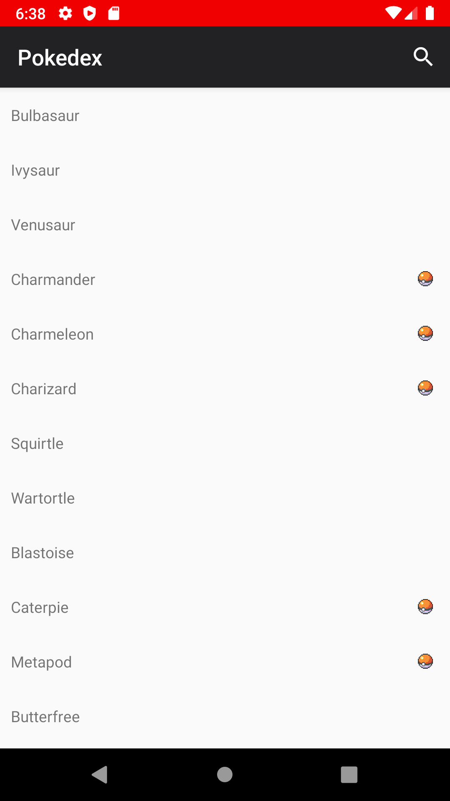
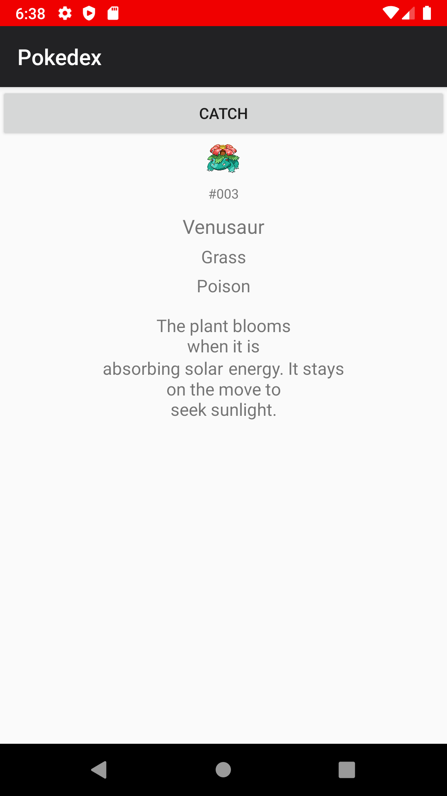
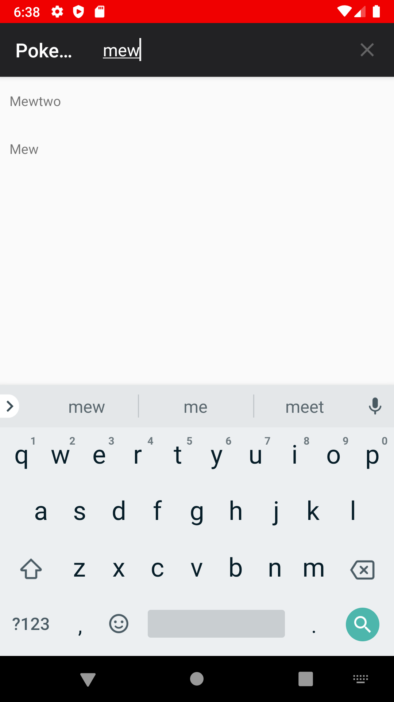

# Pokedex - Android

A 1st Generation Pokedex Android app, created following [Harvard's CS50 Android track](https://cs50.harvard.edu/x/2020/tracks/mobile/android/pokedex/).

## Main view

## Pokemon information view

## Main view search

